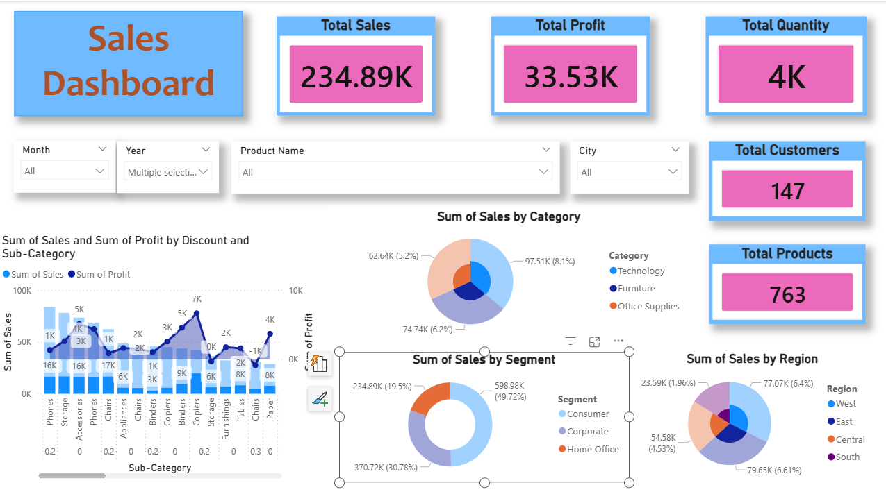

# 📊 Sales Analysis Dashboard | Power BI

## 📌 Project Overview
This project focuses on building an **end-to-end interactive sales dashboard** using **Power BI** to analyze business performance across sales, profit, customers, products, and regions. The dashboard enables stakeholders to explore insights dynamically using filters and slicers, supporting **data-driven decision-making**.

---

## 🎯 Objective
To analyze sales data and develop a Power BI dashboard that provides clear insights into:
- Overall sales and profit performance  
- Customer and product distribution  
- Regional and category-wise trends  
- Time-based sales analysis  

---

## 🛠️ Tools & Technologies
- **Power BI**
- **DAX (Data Analysis Expressions)**
- **Power Query**
- **Excel / CSV Dataset**

---

## 🔄 Data Preparation
- Cleaned and transformed raw sales data using **Power Query**
- Corrected data types and handled inconsistencies
- Prepared the dataset for accurate analysis and reporting

---

## 📐 Key DAX Measures
The following DAX measures were created to ensure accurate and dynamic calculations:

- Total Sales  
- Total Profit  
- Total Quantity  
- Total Customers (DISTINCTCOUNT)  
- Total Products (DISTINCTCOUNT)  
- Profit Margin  

These measures dynamically respond to filters such as **Year, Month, Region, Category, and Segment**.

---

## 📈 Dashboard Features
- **KPI Cards** for quick business performance overview  
- **Interactive slicers** (Year, Month, City, Product)  
- Sales analysis by **Region, Category, and Segment**  
- Clean, professional, and business-focused dashboard layout  
- Dynamic filtering for deeper insights  

---

## 💡 Business Insights Enabled
- Identify top-performing regions and product categories  
- Analyze customer and product distribution  
- Track sales and profit trends over time  
- Support management with actionable insights  

---

## 🖼️ Dashboard Preview
(Add screenshots of the dashboard here)

```md

